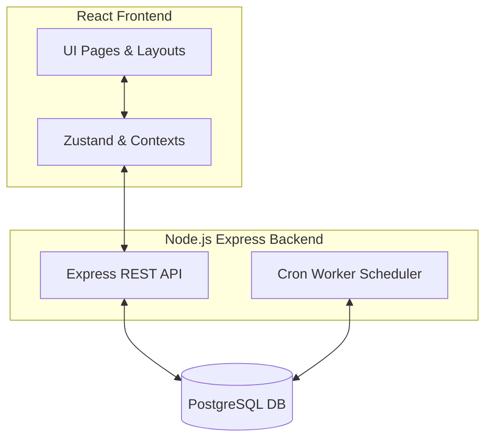

# TaskFlow

A premium, cinematic, dark-mode-first task management application featuring multi-tenant database partitioning, automatic priority scoring, and a visual analytics dashboard.

---

## Technical Architecture

The project is split into two decoupled components:

### Technology Stack
- **Frontend**: React 19, Vite, Tailwind CSS, Zustand, Recharts, Framer Motion
- **Backend**: Node.js, Express, PostgreSQL, TypeORM, Zod Validation

---

## Working of the Project

### 1. Priority Engine
- Every time a task is created or updated, the backend scoring engine evaluates a dynamic priority score based on:
  - **Impact Weight**: HIGH (highest), MEDIUM, or LOW
  - **Time Proximity**: Time remaining until the task's due date
  - **Status**: Completed tasks drop to a priority score of `0`
- The system bubbles up the tasks with the highest priority scores to the dashboard as the **Primary Focus Targets** (up to 3 tasks).

### 2. Background Cron Workers
The backend deploys a background task scheduler inside `reminder.worker.js` that runs every **10 minutes**:
1. **Auto-Delete**: Locates all tasks with a status of `COMPLETED` that were last updated (`updatedAt`) more than **10 days ago** and permanently purges them to keep the database lean.

---

## Data Sync Profiling

- **REST API Flow**:
  - The application uses standard REST APIs to sync data between the React frontend and the Express backend.
  - State management is gracefully handled by **Zustand**, which caches data to minimize unnecessary refetches.
- **Client-Side Intervals (0 Network Traffic)**:
  - The `TasksPage` runs a local timer every **60 seconds** to calculate task archiving states locally in React state (no database or API calls are made).
