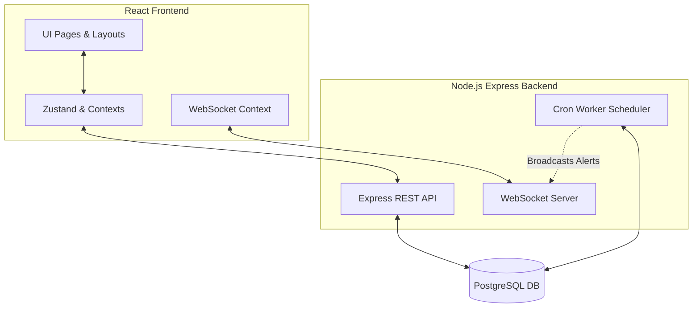

# ObsidianFlow

A premium, cinematic, dark-mode-first task management application featuring multi-tenant database partitioning, real-time warning streams via WebSockets, automatic priority scoring, and a visual analytics dashboard.

---

## Technical Architecture

The project is split into two decoupled components:

### Technology Stack
- **Frontend**: React 19, Vite, Tailwind CSS, Zustand, Recharts, Framer Motion
- **Backend**: Node.js, Express, PostgreSQL, TypeORM, Zod Validation, WebSockets (`ws`)

---

## Working of the Project

### 1. Real-time Telemetry
- Upon user authentication, the frontend establishes a secure **WebSocket connection** directly to the gateway `ws://localhost:8000/ws/notifications?token=<jwt_token>`.
- When background cron workers detect approaching deadlines, they log notification events in the database and push these warnings to the user's active sockets.
- The frontend interceptor listens to incoming socket payloads:
  1. Triggers a secure visual toast notification alert on the screen.
  2. Dispatches a window-wide `obsidian_flow_refresh` event.
  3. Pages (`Dashboard`, `Tasks`) intercept this event and dynamically re-sync their views with the latest REST API payloads.

### 2. Priority Engine
- Every time a task is created or updated, the backend scoring engine evaluates a dynamic priority score based on:
  - **Impact Weight**: HIGH (highest), MEDIUM, or LOW
  - **Time Proximity**: Time remaining until the task's due date
  - **Status**: Completed tasks drop to a priority score of `0`
- The system bubbles up the task with the highest priority score to the dashboard as the **Primary Focus Target**.

### 3. Background Cron Workers
The backend deploys a background task scheduler inside [reminder.worker.js](file:///d:/Projects/smart-task-manager/backend/src/workers/reminder.worker.js) that runs every **10 minutes**:
1. **Auto-Delete**: Locates all tasks with a status of `COMPLETED` that were last updated (`updatedAt`) more than **10 days ago** and permanently purges them.
2. **Predictive Deadlines**: Scans all `PENDING` tasks:
   - If a task is due in **less than 1 hour** (and the user has `remind1h` enabled), a `1-Hour Warning` alert is logged and pushed.
   - If a task is due in **less than 3 hours** (and the user has `remind3h` enabled), a `3-Hour Warning` alert is logged and pushed.

---

## API Request Profiling

### Active/Background API Request Loops
- **WebSocket (1 Persistent Connection)**: Stays open continuously. Utilizes minimal keep-alive heartbeat pings.
- **REST API Auto-Polling (0 Periodic Network Requests)**: 
  - The application uses an **event-driven refresh architecture** rather than polling endpoints on a timer.
  - No background `setInterval` fetches are used. 
  - Re-fetches only occur on-demand when the WebSocket server pushes a `NOTIFICATION_RECEIVED` event.
- **Event-Driven Auto-Requests**:
  - **On Dashboard Page**: On event trigger, executes **4 parallel REST API calls** (`GET /tasks`, `GET /dashboard`, `GET /tasks/focus`, `GET /notifications`).
  - **On Tasks Page**: On event trigger, executes **1 REST API call** (`GET /tasks`).
- **Client-Side Intervals (0 Network Traffic)**:
  - The `TasksPage` runs a local timer every **60 seconds** to calculate task archiving states locally in React state (no database or API calls are made).
